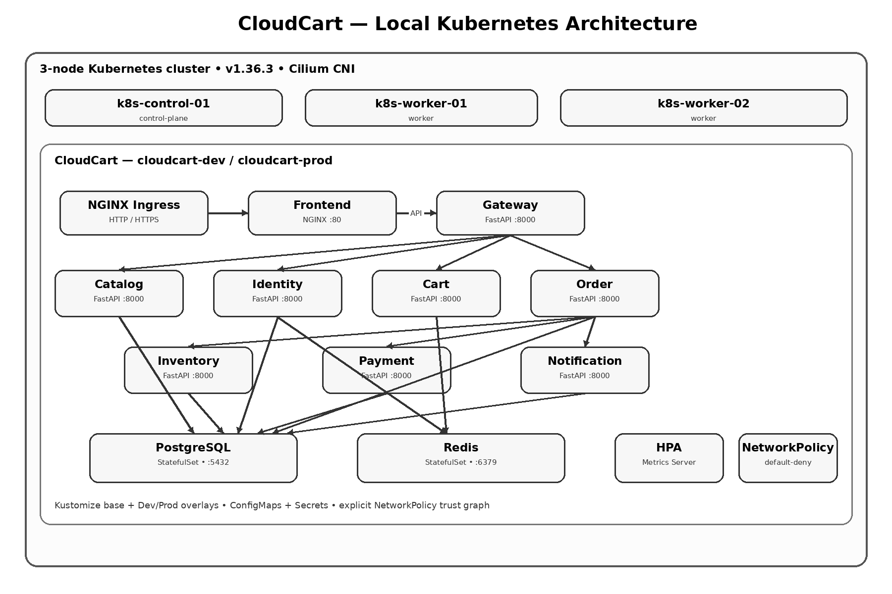

# CloudCart — Local Kubernetes Platform

CloudCart is a production-like e-commerce microservices application deployed on a **local Kubernetes cluster**.

This repository focuses on the **Kubernetes platform and operational configuration** around CloudCart. The application itself is included under `cloudcart-application/` as the workload used to exercise Kubernetes concepts.

> **Current scope:** Local Kubernetes only. Cloud/EKS, Terraform, Argo CD, Prometheus, Grafana, and other cloud/platform extensions are intentionally outside the scope of this repository for now.

## Architecture



### High-level request flow

```text
Users
  |
  v
NGINX Ingress
  |----------------------|
  v                      v
Frontend               Gateway
NGINX :80             FastAPI :8000
                         |
             +-----------+-----------+-----------+
             |           |           |           |
             v           v           v           v
          Catalog     Identity      Cart        Order
                         |            |            |
                         +-----+------+            +------+
                               |                          |
                               v                          v
                             Redis                   Inventory
                                                        |
                                                     Payment

PostgreSQL is used by the services that require relational persistence.
Notification is a separate application service.
```

The logical application graph is intentionally narrowed by Kubernetes NetworkPolicies. Only explicitly required communication paths are permitted.

## Kubernetes Cluster

Current local cluster:

| Node | Role | Kubernetes |
|---|---|---|
| `k8s-control-01` | control-plane | v1.36.3 |
| `k8s-worker-01` | worker | v1.36.3 |
| `k8s-worker-02` | worker | v1.36.3 |

**CNI:** Cilium

The cluster is treated as a **production-like Kubernetes environment**, rather than only a disposable development cluster.

## Project Goals

This project demonstrates:

- Containerized microservices on Kubernetes
- Deployments and Services
- Stateful workloads
- Kubernetes service discovery
- NGINX Ingress
- Kustomize
- Separate Dev and Prod namespaces
- ConfigMaps and Secrets
- Kubernetes NetworkPolicies
- Horizontal Pod Autoscaling
- Metrics Server
- Production-oriented networking and operational practices

The application is intentionally kept simple so the main focus remains **DevOps and Kubernetes operations**, not application development.

## CloudCart Application

| Component | Purpose |
|---|---|
| Frontend | Browser-facing web UI served through NGINX |
| Gateway | API entry point and service routing |
| Catalog | Product/catalog functionality |
| Identity | Registration, login, and identity operations |
| Cart | Shopping cart functionality |
| Inventory | Inventory operations |
| Order | Order creation and order-related operations |
| Payment | Payment simulation |
| Notification | Notification-related functionality |
| PostgreSQL | Persistent relational application data |
| Redis | Session/cart state |

Application source and container definitions are under:

```text
cloudcart-application/
```

# Repository Structure

```text
.
├── README.md
├── base/
│   ├── autoscaling/
│   ├── config/
│   ├── ingress/
│   ├── namespace/
│   ├── policies/
│   ├── postgres/
│   ├── redis/
│   ├── services/
│   └── kustomization.yaml
├── cloudcart-application/
│   ├── README.md
│   ├── compose.production.yaml
│   ├── frontend/
│   ├── gateway/
│   └── services/
├── diagrams/
├── kustomization.yaml
└── overlays/
    ├── dev/
    │   ├── configmap-patch.yaml
    │   ├── ingress-patch.yaml
    │   ├── kustomization.yaml
    │   ├── namespace-patch.yaml
    │   └── secret-patch.yaml
    └── prod/
        ├── kustomization.yaml
        └── namespace-patch.yaml
```

## Kustomize Architecture

```text
                    base/
                      |
             +--------+--------+
             |                 |
             v                 v
        overlays/dev      overlays/prod
             |                 |
             v                 v
       cloudcart-dev      cloudcart-prod
```

The `base/` directory contains the reusable, production-like Kubernetes configuration. Overlays provide environment-specific changes.

### Base

Contains:

- Application Deployments
- Services
- PostgreSQL
- Redis
- Ingress
- ConfigMap
- Secret
- TLS Secret
- NetworkPolicies
- HPAs

The base remains complete and deployable.

### Dev Overlay

The Dev overlay applies environment-specific configuration including:

- `cloudcart-dev` namespace
- Dev storefront/API hostnames
- Dev environment settings
- Dev database configuration
- Dev image tags

### Prod Overlay

The Prod overlay applies:

- `cloudcart-prod` namespace
- Production image tags
- Production namespace identity

## Namespaces

```text
cloudcart-dev
cloudcart-prod
```

Environment separation is provided by namespaces rather than resource name prefixes/suffixes.

Namespace identity uses labels such as:

```yaml
app.kubernetes.io/name: cloudcart
app.kubernetes.io/instance: cloudcart-dev
app.kubernetes.io/component: namespace
app.kubernetes.io/part-of: cloudcart
app.kubernetes.io/managed-by: kustomize
```

Prod uses `cloudcart-prod` as the instance label.

# Networking

## Ingress

NGINX Ingress Controller provides the external HTTP/HTTPS entry point:

```text
Browser
   |
   v
NGINX Ingress Controller
   |
   +----> Frontend Service :80
   |
   +----> Gateway Service :8000
```

### Dev

```text
devshop.cloudsystemonline.com
devapi.cloudsystemonline.com
```

### Production

```text
shop.cloudsystemonline.com
api.cloudsystemonline.com
```

## Internal Service Discovery

CloudCart services communicate through Kubernetes Services and internal DNS.

Examples:

```text
cloudcart-gateway-service:8000
cloudcart-catalog-service:8000
cloudcart-identity-service:8000
cloudcart-cart-service:8000
cloudcart-order-service:8000
cloudcart-inventory-service:8000
cloudcart-payment-service:8000
cloudcart-notification-service:8000
cloudcart-postgresql-service:5432
cloudcart-redis-service:6379
```

## NetworkPolicies

Network security follows a **default-deny** model.

```text
Default Deny
     |
     +---- DNS allowance
     |
     +---- Ingress -> Frontend
     |
     +---- Ingress -> Gateway
     |
     +---- Gateway -> application services
     |
     +---- Services -> required data stores
```

Policies currently cover:

```text
01-default-deny
02-allow-dns
03-postgresql
04-redis
05-frontend
06-gateway
07-catalog
08-identity
09-cart
10-inventory
11-order
12-payment
13-notification
```

The intended trust graph is:

```text
Ingress Controller
       |
       +----> Frontend
       |
       +----> Gateway
                 |
                 +----> Catalog
                 +----> Identity ----> PostgreSQL
                 |             |
                 |             +----> Redis
                 |
                 +----> Cart ---------> Redis
                 |
                 +----> Order
                           |
                           +----> PostgreSQL
                           +----> Inventory
                           +----> Payment
```

Only the required database/cache consumers are allowed to connect to PostgreSQL and Redis.

DNS access is explicitly allowed to CoreDNS.

> **Operational note:** NetworkPolicies control traffic to the actual Pod ports. For example, the CloudCart Gateway listens on TCP `8000`, so its policy must permit TCP `8000` from the allowed Ingress Controller pods.

# Configuration

## ConfigMap

Non-sensitive runtime configuration is maintained in:

```text
base/config/configmap.yaml
```

Environment-specific values are patched by the overlays.

## Secret

Sensitive database configuration is maintained through:

```text
base/config/secret.yaml
```

Environment-specific database settings are overridden in the Dev overlay.

> Real production credentials should not be committed to Git. A dedicated secret-management solution would be appropriate for a real production platform.

## TLS

TLS configuration is maintained in:

```text
base/config/tls-secret.yaml
```

Ingress uses TLS for the browser-facing hostnames.

# Stateful Workloads

## PostgreSQL

```text
StatefulSet
    |
    +---- Headless Service
    |
    +---- TCP/5432
```

PostgreSQL stores persistent business/application data.

## Redis

```text
StatefulSet
    |
    +---- Headless Service
    |
    +---- TCP/6379
```

Redis is used for session/cart-related state.

The application therefore separates:

```text
Stateless
  ├── Frontend
  ├── Gateway
  ├── Catalog
  ├── Identity
  ├── Cart
  ├── Inventory
  ├── Order
  ├── Payment
  └── Notification

Stateful
  ├── PostgreSQL
  └── Redis
```

# Autoscaling

HPAs are configured for:

- Gateway
- Catalog
- Identity
- Cart
- Inventory
- Order
- Payment
- Frontend

The HPAs use the Kubernetes **Metrics Server**.

PostgreSQL, Redis, and Notification do not currently use HPA.

# Deployment

## Render the Base

```bash
kubectl kustomize base
```

## Render Dev

```bash
kubectl kustomize overlays/dev
```

## Render Prod

```bash
kubectl kustomize overlays/prod
```

## Apply Dev

```bash
kubectl apply -k overlays/dev
```

## Apply Prod

```bash
kubectl apply -k overlays/prod
```

# Verification

### Nodes

```bash
kubectl get nodes
```

### Pods

```bash
kubectl -n cloudcart-dev get pods
kubectl -n cloudcart-prod get pods
```

### Services

```bash
kubectl -n cloudcart-dev get svc
```

### Ingress

```bash
kubectl -n cloudcart-dev get ingress
```

### HPA

```bash
kubectl -n cloudcart-dev get hpa
```

### NetworkPolicies

```bash
kubectl -n cloudcart-dev get networkpolicy
```

# Operational Validation Checklist

### Cluster

- [x] All three nodes are Ready
- [x] CoreDNS access is explicitly allowed
- [x] Cilium is used as the CNI
- [x] Metrics Server is available

### Application

- [x] Application workloads are deployed
- [x] Services have been validated
- [x] Frontend is reachable
- [x] API Gateway is reachable
- [x] Product listing works
- [x] Login works
- [x] Core cart/order flow is functional

### Data

- [x] PostgreSQL is running
- [x] Redis is running
- [x] Required application-to-data paths are allowed

### Networking

- [x] Ingress routing works
- [x] HTTP/HTTPS routing works
- [x] Default-deny NetworkPolicy is enabled
- [x] DNS traffic is explicitly allowed
- [x] Service-to-service access is explicitly restricted

### Scaling

- [x] Metrics Server provides resource metrics
- [x] HPAs are configured for the main application workloads

# Troubleshooting Approach

Troubleshoot from the outside in:

```text
Ingress
  ↓
Service
  ↓
Pod
  ↓
Application
  ↓
Dependency
  ↓
NetworkPolicy
```

Useful commands:

```bash
kubectl get nodes
kubectl get pods -A

kubectl -n cloudcart-dev get all

kubectl -n cloudcart-dev get svc
kubectl -n cloudcart-dev get endpoints

kubectl -n cloudcart-dev describe ingress cloudcart-ingress

kubectl -n cloudcart-dev describe pod <pod>
kubectl -n cloudcart-dev logs <pod>

kubectl -n cloudcart-dev get networkpolicy
kubectl -n cloudcart-dev describe networkpolicy <policy>
```

When NetworkPolicies are enabled, troubleshooting should respect the intended trust graph rather than bypassing policies with arbitrary temporary workloads.

# Application vs Platform Responsibility

### Application

- Basic e-commerce functionality
- Service APIs
- Frontend
- Database interactions
- Redis-backed session/cart state

### Kubernetes platform

- Scheduling
- Service discovery
- Networking
- Ingress
- Environment separation
- Configuration
- Secret injection
- Network isolation
- Autoscaling
- Stateful workload management

This separation keeps CloudCart useful as a Kubernetes and DevOps platform project without turning application development into the primary objective.

# Current Status

## Completed

- [x] CloudCart application baseline
- [x] Dockerized application
- [x] Production-like Docker Compose baseline
- [x] Kubernetes base manifests
- [x] Kustomize structure
- [x] Dev namespace
- [x] Prod namespace
- [x] Dev overlay
- [x] Prod overlay
- [x] PostgreSQL StatefulSet
- [x] Redis StatefulSet
- [x] Kubernetes Services
- [x] NGINX Ingress
- [x] ConfigMap
- [x] Secret configuration
- [x] TLS configuration
- [x] Default-deny NetworkPolicy
- [x] DNS NetworkPolicy
- [x] Service-specific NetworkPolicies
- [x] Metrics Server
- [x] Horizontal Pod Autoscaling
- [x] Application verification
- [x] NetworkPolicy validation and correction

## Intentionally Outside Current Scope

- Cloud infrastructure
- EKS
- Terraform
- Argo CD
- Prometheus
- Grafana
- Alertmanager
- Cloud-native load balancers
- Managed database/cache services

These belong to later stages of the broader CloudCart DevOps journey and are not part of this local Kubernetes repository's current implementation.

# Design Principles

### Production-like local infrastructure

The local cluster is operated using production-oriented Kubernetes practices.

### Least-privilege networking

Traffic is denied by default and explicitly allowed where required.

### Reusable base

Common Kubernetes resources belong in `base/`.

### Environment overlays

Dev/Prod differences belong in `overlays/`.

### Minimal application complexity

CloudCart exists primarily as a realistic workload for Kubernetes and DevOps operations.

### Validate before modifying

Working infrastructure should be inspected and tested before making configuration changes.

# Status

**Local Kubernetes Platform — COMPLETE**

CloudCart is currently deployed as a production-like microservices workload on a three-node local Kubernetes cluster with:

- Kustomize
- Dev/Prod namespaces
- NGINX Ingress
- PostgreSQL
- Redis
- Metrics Server
- Horizontal Pod Autoscaling
- Default-deny NetworkPolicies
- Explicit service-to-service network permissions
- TLS-enabled ingress

The local application and Kubernetes baseline are considered ready for the next stage of the CloudCart DevOps project.
