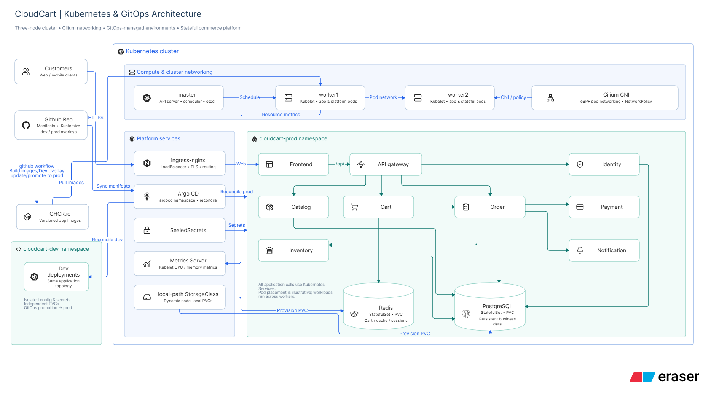

# CloudCart Kubernetes Platform

CloudCart is a production-style e-commerce platform designed to showcase Kubernetes, container orchestration, GitOps, ingress, service networking, and secure secret handling in a realistic multi-service setup.

This repository contains both the application workload and the platform configuration used to run it in Kubernetes. The application layer lives under `cloudcart-application/`, while the Kubernetes manifests, Argo CD configuration, and GitOps automation live under `kubernetes/` and `argocd/`.

## What this repo includes

- A frontend application served by NGINX
- A FastAPI API gateway and multiple backend microservices
- PostgreSQL and Redis as stateful data services
- Kustomize base manifests and environment overlays
- Argo CD deployment automation
- GitHub Actions for image builds and promotion
- Network policy and ingress configuration for a production-like cluster setup

---

## Architecture



```text
Users
  |
  v
ingress-nginx
  |
  +--------------------+
  |                    |
  v                    v
Frontend             Gateway
NGINX                FastAPI
  |                    |
  |                    +----> Catalog
  |                    +----> Identity ----> PostgreSQL
  |                    +----> Cart ---------> Redis
  |                    +----> Inventory
  |                    +----> Order --------> PostgreSQL
  |                    +----> Payment
  |                    +----> Notification
  |
  +--> static frontend assets / browser UI
```

The application is intentionally designed to be simple enough to reason about, while still showing Kubernetes networking, gating, and operational patterns.

---

## Cluster prerequisites

This repository assumes the following are already installed and configured on the target Kubernetes cluster.

### 1. Argo CD installed via Helm

Argo CD is expected to be running in the `argocd` namespace and is used to reconcile the environment overlays.

Example installation pattern:

```bash
helm repo add argo https://argoproj.github.io/argo-helm
helm repo update
helm install argocd argo/argo-cd -n argocd --create-namespace
```

This repo includes:

- `bootstrap.yaml` to bootstrap the root Argo CD application
- `argocd/01-projects.yaml` for the dev/prod AppProjects
- `argocd/02-application-set.yaml` for environment synchronization

### 2. Sealed Secrets enabled for secret management

This project assumes SealedSecrets is in place for sensitive values such as DB credentials and app secrets.

Example installation pattern:

```bash
helm repo add sealed-secrets https://bitnami-labs.github.io/sealed-secrets
helm repo update
helm install sealed-secrets sealed-secrets/sealed-secrets -n kube-system
```

Sealed secret YAML files already exist in overlays such as:

- `kubernetes/overlays/dev/sealed-postgresql-secret.yaml`
- `kubernetes/overlays/prod/sealed-postgresql-secret.yaml`

This keeps real secret material out of Git while still allowing secure reconciliation into the cluster.

### 3. Ingress controller installed via Helm

The cluster uses `ingress-nginx` as the external ingress controller.

Example installation pattern:

```bash
helm repo add ingress-nginx https://kubernetes.github.io/ingress-nginx
helm repo update
helm install ingress-nginx ingress-nginx/ingress-nginx -n ingress-nginx --create-namespace
```

The ingress configuration is defined in:

- `kubernetes/base/ingress/ingress.yaml`
- `kubernetes/overlays/dev/ingress-patch.yaml`

### 4. StorageClass available for local workloads

The environment is expected to provide the `rancher.io/local-path` StorageClass for PVC-backed workload storage.

Example validation:

```bash
kubectl get storageclass
kubectl get sc
```

This is important for PostgreSQL and any stateful components that need persistent storage.

### 5. Kubernetes networking and CNI baseline

The repo is designed for a modern cluster with a CNI and default networking protections, and it explicitly uses NetworkPolicy examples for least-privilege communication.

---

## Repository layout

```text
.
├── README.md
├── bootstrap.yaml
├── .github/
│   └── workflows/
│       ├── deploy-images.yaml
│       └── promote-to-prod.yaml
├── argocd/
│   ├── 01-projects.yaml
│   └── 02-application-set.yaml
├── cloudcart-application/
│   ├── .env.example
│   ├── docker-compose.yaml
│   ├── README.md
│   ├── frontend/
│   ├── gateway/
│   └── services/
├── diagrams/
├── kubernetes/
│   ├── base/
│   └── overlays/
│       ├── dev/
│       └── prod/
└── .gitignore
```

The actual Kubernetes resources are organized as:

- `kubernetes/base` for shared manifests
- `kubernetes/overlays/dev` for dev environment overrides
- `kubernetes/overlays/prod` for production environment overrides

---

## Application components

| Component | Role |
|---|---|
| Frontend | Browser-facing storefront UI |
| Gateway | API entry point and proxy layer |
| Catalog | Product/catalog logic |
| Identity | Login, registration, session handling |
| Cart | Cart and session state operations |
| Inventory | Inventory validation |
| Order | Order orchestration |
| Payment | Payment simulation |
| Notification | Notification workflow |
| PostgreSQL | Persistent relational data |
| Redis | Session and cart state |

---

## GitOps and release flow

This repository uses Argo CD as the reconciliation engine and GitHub Actions for image publishing.

### Image build and dev promotion

The workflow in `.github/workflows/deploy-images.yaml` does the following:

1. Detects changed service directories
2. Builds changed images with Docker Compose
3. Pushes them to GHCR
4. Updates the dev overlay image tags using Kustomize
5. Commits the updated manifest back to the repo

This allows Argo CD to deploy the updated dev environment automatically.

### Production promotion

The workflow in `.github/workflows/promote-to-prod.yaml` does the following:

1. Reads the current image tags from the dev overlay
2. Propagates those values into the prod overlay
3. Updates the prod target revision in `argocd/02-application-set.yaml`
4. Forces the release tag to point to the final production state

This is the main promotion path for the repo.

---

## Local application startup

The app can be run locally with Docker Compose before or alongside Kubernetes testing.

### 1. Prepare environment file

```bash
cp cloudcart-application/.env.example cloudcart-application/.env
```

### 2. Start the stack

```bash
docker compose --file cloudcart-application/docker-compose.yaml --project-directory cloudcart-application up -d
```

### 3. Verify availability

```bash
curl http://localhost
curl http://localhost/api/health
```

The frontend is served by NGINX and proxied to the gateway API layer. The gateway health endpoint is available at `/health`.

---

## Kubernetes deployment

### Render manifests

```bash
kubectl kustomize kubernetes/overlays/dev
kubectl kustomize kubernetes/overlays/prod
```

### Apply dev environment

```bash
kubectl apply -k kubernetes/overlays/dev
```

### Apply prod environment

```bash
kubectl apply -k kubernetes/overlays/prod
```

### Validate core resources

```bash
kubectl get nodes
kubectl get storageclass
kubectl get pods -n cloudcart-dev
kubectl get svc -n cloudcart-dev
kubectl get ingress -n cloudcart-dev
kubectl get hpa -n cloudcart-dev
kubectl get networkpolicy -n cloudcart-dev
```

---

## Network and security model

The platform intentionally follows a least-privilege model using NetworkPolicies.

Important patterns in this repo:

- default deny for pod-to-pod traffic
- explicit DNS access allowance
- ingress allowed only to selected frontend/gateway services
- service-to-service access limited to required data paths
- backend access to PostgreSQL and Redis restricted to the services that need it

This is one of the main operational themes of the repo.

---

## Secret and configuration model

### Configuration

Non-sensitive settings are kept in Kustomize-managed config and overlay patches.

### Secrets

Sensitive values are managed with SealedSecrets rather than plain YAML secrets in Git.

This keeps the repo safe while still letting Argo CD reconcile sensitive data into the target cluster.

---

## Deployment requirements checklist

Before using this repo in a cluster, make sure the following are true:

- [ ] Kubernetes cluster is up and healthy
- [ ] `rancher.io/local-path` StorageClass exists
- [ ] `ingress-nginx` is installed via Helm
- [ ] Argo CD is installed via Helm in `argocd`
- [ ] SealedSecrets controller is installed and working
- [ ] GitHub Actions can push to GHCR
- [ ] App and overlay repos are reachable by Argo CD

---

## Operational notes

- The application is intentionally kept relatively lightweight so the focus stays on platform operations, not app complexity.
- The repo is designed to model a production-like Kubernetes workflow rather than a toy demo-only cluster.
- The repo supports both local Docker Compose testing and cluster-based GitOps deployment.
- Frontend, gateway, and service APIs are intentionally environment-driven so the same images can be promoted without rebuilds for simple configuration changes.

---

## Summary

This repository demonstrates a complete GitOps-driven microservice platform built around:

- Kubernetes manifests and overlays
- Argo CD synchronization
- Helm-based platform prerequisites
- SealedSecrets for secret handling
- ingress-nginx for external routing
- local-path storage for PVC-backed workloads
- GitHub Actions for image promotion and delivery

It is a strong example of a real-world platform workflow for a small but realistic cloud-native application.

- [x] Metrics Server provides resource metrics
- [x] HPAs are configured for the main application workloads

# Troubleshooting Approach

Troubleshoot from the outside in:

```text
Ingress
  ↓
Service
  ↓
Pod
  ↓
Application
  ↓
Dependency
  ↓
NetworkPolicy
```

Useful commands:

```bash
kubectl get nodes
kubectl get pods -A

kubectl -n cloudcart-dev get all

kubectl -n cloudcart-dev get svc
kubectl -n cloudcart-dev get endpoints

kubectl -n cloudcart-dev describe ingress cloudcart-ingress

kubectl -n cloudcart-dev describe pod <pod>
kubectl -n cloudcart-dev logs <pod>

kubectl -n cloudcart-dev get networkpolicy
kubectl -n cloudcart-dev describe networkpolicy <policy>
```

When NetworkPolicies are enabled, troubleshooting should respect the intended trust graph rather than bypassing policies with arbitrary temporary workloads.

# Application vs Platform Responsibility

### Application

- Basic e-commerce functionality
- Service APIs
- Frontend
- Database interactions
- Redis-backed session/cart state

### Kubernetes platform

- Scheduling
- Service discovery
- Networking
- Ingress
- Environment separation
- Configuration
- Secret injection
- Network isolation
- Autoscaling
- Stateful workload management

This separation keeps CloudCart useful as a Kubernetes and DevOps platform project without turning application development into the primary objective.

# Current Status

## Completed

- [x] CloudCart application baseline
- [x] Dockerized application
- [x] Production-like Docker Compose baseline
- [x] Kubernetes base manifests
- [x] Kustomize structure
- [x] Dev namespace
- [x] Prod namespace
- [x] Dev overlay
- [x] Prod overlay
- [x] PostgreSQL StatefulSet
- [x] Redis StatefulSet
- [x] Kubernetes Services
- [x] NGINX Ingress
- [x] ConfigMap
- [x] Secret configuration
- [x] TLS configuration
- [x] Default-deny NetworkPolicy
- [x] DNS NetworkPolicy
- [x] Service-specific NetworkPolicies
- [x] Metrics Server
- [x] Horizontal Pod Autoscaling
- [x] Application verification
- [x] NetworkPolicy validation and correction

# Design Principles

### Production-like local infrastructure

The local cluster is operated using production-oriented Kubernetes practices.

### Least-privilege networking

Traffic is denied by default and explicitly allowed where required.

### Reusable base

Common Kubernetes resources belong in `base/`.

### Environment overlays

Dev/Prod differences belong in `overlays/`.

### Minimal application complexity

CloudCart exists primarily as a realistic workload for Kubernetes and DevOps operations.

### Validate before modifying

Working infrastructure should be inspected and tested before making configuration changes.

# Status

**Local Kubernetes Platform — COMPLETE**

CloudCart is currently deployed as a production-like microservices workload on a three-node local Kubernetes cluster with:

- Kustomize
- Dev/Prod namespaces
- NGINX Ingress
- PostgreSQL
- Redis
- Metrics Server
- Sealed Secret
- Horizontal Pod Autoscaling
- Default-deny NetworkPolicies
- Explicit service-to-service network permissions
- TLS-enabled ingress

The local application and Kubernetes baseline are considered ready for the next stage of the CloudCart DevOps project.
